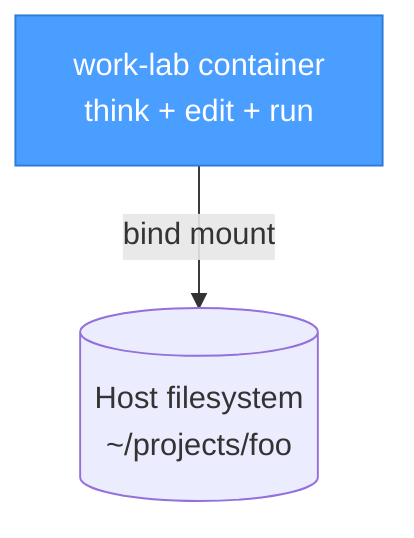
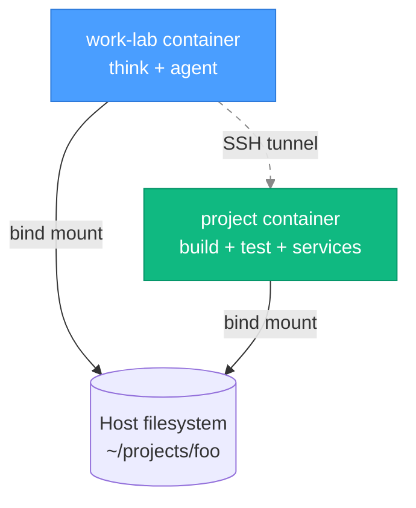
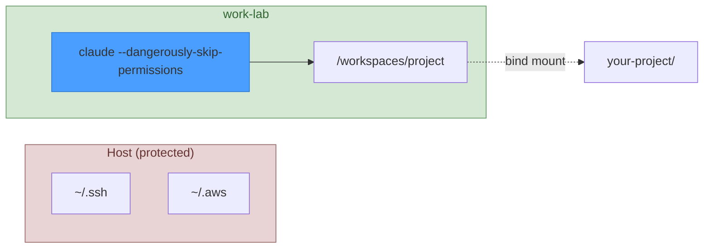

<!-- doc-audience: human -->
# work-lab (Embracing Post-2025 Futuristic Development)

[](https://github.com/modern-tooling/ai-human-docs)

A container-based lab for humans and AI coding agents to think, plan, code, and operate in an experimental space protected by guardrails.

**Why it's great:**

- **Works standalone** - Want to run an AI agent within a environment with guardrails? `work-lab` IS your answer
- **Works with devcontainers** - Run alongside any project's devcontainer via SSH tunnel
- **Zero project changes** - Never modifies your repos
- **Safe agent execution** - Run `claude --dangerously-skip-permissions` without the danger
- **One command** - `wl up && wl mux` and you're in

## TL;DR

| Your situation | Mode | What to do |
|----------------|------|------------|
| Project has no devcontainer | **Standalone** | `work-lab` is your devcontainer |
| Project has existing [devcontainer](https://www.daytona.io/dotfiles/ultimate-guide-to-dev-containers?utm_source=chatgpt.com) | **Sidecar** | Run both containers side-by-side |

> **Mental model:**
> work-lab is where you think and operate.
> Project devcontainers are where things run.
> They do not need to be the same place.

## What this is

`work-lab` is an **optional, personal** environment for:

- Thinking and planning
- Running coding agent tooling ([Claude](https://github.com/anthropics/claude-code), [Gastown](https://github.com/steveyegge/gastown), [SageOx](https://github.com/sageox/))
- Experimenting safely (e.g. `claude --dangerously-skip-permissions`)

It provides a consistent safe environment for engaging with your tools and AI coding agents, independent of whatever project you're working on.

## What this is NOT

- **Not a project template.** This repo never modifies the projects you work on.
- **Not a replacement for project devcontainers.** If a project has its own devcontainer, that's where builds and services run.
- **Not infrastructure.** No databases, no services, no application orchestration.

---

## Prerequisites

**Platform:** Linux and macOS only. Windows is not currently supported (contributions welcome).

| Requirement | Purpose | Install |
|-------------|---------|---------|
| [Docker](https://docs.docker.com/get-docker/) | Container runtime | `brew install --cask docker` (or alternatives) |
| [devcontainer CLI](https://github.com/devcontainers/cli) | Start containers from CLI | `npm install -g @devcontainers/cli` |

Optional:
- [Homebrew](https://brew.sh/) — For easy installation on macOS/Linux
- [Zellij](https://github.com/zellij-org/zellij) — Modern tmux alternative

---

## Installation

Choose your preferred method:

### Homebrew (recommended on MacOS)

```bash
brew tap modern-tooling/tap
brew install work-lab
```

### One-liner

```bash
curl -fsSL https://raw.githubusercontent.com/modern-tooling/work-lab/main/install.sh | bash
```

This clones to `~/.local/share/work-lab` (XDG compliant), creates config directory, and pulls the pre-built image.

### GitHub Template

Click **"Use this template"** at the top of this repo to create your own customized version.

### Manual

```bash
git clone https://github.com/modern-tooling/work-lab.git ~/.local/share/work-lab
export PATH="$PATH:$HOME/.local/share/work-lab/bin"
```

---

## Quick start

```bash
cd /path/to/your/project     # Any git repository
work-lab doctor              # Check your environment
work-lab up                  # Start the container
work-lab mux                 # Attach to tmux session (or zellij if configured)
```

Inside the container:

```bash
cd /workspaces/project       # Your project is mounted here
claude                       # or gt (gastown), opencode, aider, etc.
```

### Helper commands

```bash
work-lab up       # Start the devcontainer
work-lab shell    # Attach an interactive shell
work-lab mux      # Attach to multiplexer (tmux default, or zellij)
work-lab stop     # Stop the container
work-lab ps       # List running work-lab containers
work-lab doctor   # Check environment and configuration
work-lab version  # Show version information
```

**Tip:** Add a short alias to your shell profile (`~/.bashrc` or `~/.zshrc`):

```bash
alias wl='work-lab'
```

Then use:

```bash
wl up      # Same as: work-lab up
wl mux     # Same as: work-lab mux
```

---

## Usage modes

### Standalone mode

`work-lab` **is** the devcontainer. One container does everything.



**When to use:** Project has no devcontainer, or you don't need its build environment.

**Why it works well:**
- No repo changes required
- Safe agent execution
- Reproducible tools
- One mental model

### Sidecar mode (Work with existing Devcontainer)

Run `work-lab` alongside your project's devcontainer. Both containers mount the same project - `work-lab` handles AI agents, the devcontainer runs your entire development environment (builds, tests, services, databases, the works).



**When to use:** Project has its own devcontainer with specific build tools, services, or runtime.

| Container | Purpose |
|-----------|---------|
| work-lab | Thinking, agents, operations |
| Project's devcontainer | Build, run, test, services |

**The magic:** From inside `work-lab`, run commands in the devcontainer:

```bash
wl dc npm test      # runs in devcontainer
wl dc make build    # runs in devcontainer
# prefix + S         # SSH into devcontainer (from tmux)
```

Zero configuration needed - just add the [sshd feature](https://github.com/devcontainers/features/tree/main/src/sshd) to your devcontainer.json and work-lab handles the rest.

**Key insight:** You do NOT merge devcontainers. They run independently, sharing only the filesystem via the host.

> **Avoid:** Nesting containers, sharing Docker sockets, syncing services. These lead to fragility.

---

## Installed tools inside Work Lab

You can always update your `~/.config/work-lab/post-create.sh` to install additional tools into the base `work-lab` environment:

| Tool | Purpose |
|------|---------|
| git, curl, jq, ripgrep, fzf | Standard utilities |
| Node.js 22 LTS | JavaScript runtime |
| Go 1.24 | Go runtime (for gastown) |
| tmux | Persistent terminal sessions (useful for coding orchestrator) |
| [Claude CLI](https://github.com/anthropics/claude-code) | AI coding agent (optional to use)|
| [Beads](https://github.com/steveyegge/beads) | Task management for AI coding agents (optional to use) |
| [Gastown](https://github.com/steveyegge/gastown) (`gt`) | AI coding agent orchestrator (optional to use) |

> **Note:** `work-lab` is **not** specifically for Gastown — it's a general-purpose environment for any AI coding agent. Gastown happens to be one of the best AI coding agent orchestrators as of January 2026, so it's included by default.

> **Future change:** Claude Code may be removed as a pre-installed default in a future release. You can always install it via `~/.config/work-lab/post-create.sh` if needed.

### Example: Running Gastown

```bash
work-lab mux                 # Attach to work-lab
cd /workspaces/project       # Your project is already here
gt                           # Start Gastown orchestrator
```

---

## Configuration

### Project mounting

When you run `work-lab up` from any git repository, your project is automatically mounted to `/workspaces/project` in the container. No configuration needed for basic usage.

### User customization

Customize work-lab via `~/.config/work-lab/` on your host (XDG convention):

| File | When it runs |
|------|--------------|
| `post-create.sh` | Once, after container creation |
| `post-start.sh` | Every time container starts |

**Example:** Install a custom coding agent:

```bash
mkdir -p ~/.config/work-lab
cat > ~/.config/work-lab/post-create.sh << 'EOF'
#!/usr/bin/env bash
npm install -g opencode
cargo install --locked zellij  # install zellij tmux alternative [optional]
EOF
```

See `examples/` for more examples.

---

## Security model

work-lab provides **container isolation** for AI coding agents. This is especially valuable when running agents with elevated permissions.

### The problem

Running `claude --dangerously-skip-permissions` on your **host machine** gives the agent access to everything your user can access:

- SSH keys (`~/.ssh`)
- Cloud credentials (`~/.aws`, `~/.config/gcloud`)
- Browser data, cookies
- All your documents
- System files

### The solution

Running the same command **inside work-lab** limits the blast radius to only what's mounted:



| Resource | On host | In work-lab |
|----------|---------|-------------|
| SSH keys (`~/.ssh`) | Accessible | Not mounted |
| Cloud credentials (`~/.aws`) | Accessible | Not mounted |
| Browser data | Accessible | Not mounted |
| System files | Accessible | Container's own |
| Your project | Accessible | `/workspaces/project` |
| Claude config (`~/.claude`) | Accessible | Mounted read-only (default) |
| XDG configs (`~/.config/*`) | Accessible | User-controlled (RO or RW) |

**Result:** Agent autonomy (no permission prompts) with bounded risk. Users can mount additional configs via `~/.config/work-lab/config`.

### Supply chain considerations

The one-liner install (`curl | bash`) and `:latest` Docker tags carry inherent supply chain risks. For higher security:

1. **Review before running:** Download `install.sh`, inspect it, then execute
2. **Pin image versions:** Use specific SHA digests instead of `:latest`
3. **Use Homebrew:** `brew install work-lab` provides formula review and checksums

---

## Design principles

1. **Boring is good.** No clever abstractions. No magic.
2. **Optional always.** Nothing here is required.
3. **No repo modifications.** Projects remain untouched.
4. **Light tooling.** Only add what reduces thinking during initial setup.
5. **Clear boundaries.** `work-lab` provides thinking space, project devcontainers run.

---

## Thanks to Our Major Contributors

- [Ryan Snodgrass](https://github.com/rsnodgrass) - [Buy a Coffee](https://buymeacoffee.com/DYks67r)
