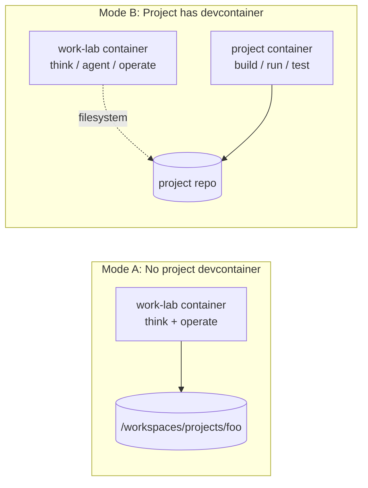

# work-lab

A calm, boring, reliable devcontainer for experimental work.

## What this is

work-lab is an **optional, personal** environment for:

- Thinking and planning
- Running coding agents and orchestrators ([Claude](https://github.com/anthropics/claude-code), [Gastown](https://github.com/steveyegge/gastown), [SageOx](https://github.com/sageox/))
- Operating with tmux
- Experimenting safely

It provides a consistent shell with your tools, independent of whatever project you're working on.

## What this is not

- **Not a project template.** This repo never modifies the projects you work on.
- **Not a replacement for project devcontainers.** If a project has its own devcontainer, that's where builds and services run.
- **Not infrastructure.** No databases, no services, no orchestration.

## The mental model

```
work-lab is where you think and operate.
Project devcontainers are where things run.
They do not need to be the same place.
```



## Quick start

1. Clone this repo
2. Open in VS Code and "Reopen in Container"
   (or run `devcontainer up --workspace-folder .`)
3. Start a tmux session: `tmux new -s lab`
4. Navigate to a mounted project and work

## Two usage modes

There are two modes. You do not mix them.

### Mode A: Projects without a devcontainer

This is the easy win, and where work-lab shines most.

**How it works:**
- work-lab *is* the devcontainer
- Mount the project repo into `/workspaces/projects/foo`
- Work entirely from inside the lab

```bash
cd /workspaces/projects/your-project
claude
gastown
# ...
```

**Why this is ideal:**
- No repo changes required
- Safe agent execution
- Reproducible tools
- One mental model

### Mode B: Projects with an existing devcontainer

This is where people get confused, but the answer is simple:

**Rule:** You do NOT try to "merge" devcontainers.

Instead:
- **Project devcontainer** = build/run environment
- **work-lab** = thinking / agent / operations environment

They are adjacent, not nested.

#### Pattern 1: work-lab drives the project container

1. Open project devcontainer (VS Code or CLI)
2. Let it run normally
3. Use work-lab to:
   - Run Claude
   - Reason about code
   - Inspect files
   - Generate patches
4. Apply changes via git / filesystem

Think: work-lab is the "control room", project container is the "machine".

#### Pattern 2: work-lab as read/write editor + agent

1. Mount the project repo into work-lab
2. Use Claude + tmux there
3. Let the project's devcontainer handle builds, tests, services

This works well when the project devcontainer is heavy, locked down, or opinionated.

#### Pattern 3: No devcontainer at all (project runs locally)

work-lab is just a safe shell + agent environment. The project runs wherever it runs.

### What you should NOT try to do

- Run project devcontainer inside work-lab
- Share Docker networks
- Sync services across containers
- "Standardize" project devcontainers via work-lab

Those paths lead to fragility and mental load.

## Installed tools

- **tmux** — persistent terminal sessions
- **git, curl, jq, ripgrep, fzf** — standard utilities
- **Node.js 22 LTS** — JavaScript runtime
- **Claude CLI** — coding agent
- **Gastown** — steveyegge's tool
- **Beads** — task management

## Mounting projects

By default, `~/projects` on your host is mounted to `/workspaces/projects` in the container.

To change this, edit `.devcontainer/devcontainer.json`:

```json
"mounts": [
  "source=/your/path/here,target=/workspaces/projects,type=bind,consistency=cached"
]
```

## Helper script (optional)

A small convenience script is provided at `bin/work-lab`:

```bash
work-lab up      # Start the devcontainer
work-lab shell   # Attach an interactive shell
work-lab tmux    # Attach to tmux session (creates 'lab' if missing)
work-lab stop    # Stop the container
```

This script is optional. You can use VS Code or the devcontainer CLI directly.

To use it, add to your PATH:

```bash
export PATH="$PATH:/path/to/work-lab/bin"
```

## Design principles

1. **Boring is good.** No clever abstractions. No magic.
2. **Optional always.** Nothing here is required.
3. **No repo modifications.** Projects remain untouched.
4. **Light tooling.** Only add what reduces thinking, not increases it.
5. **Clear boundaries.** work-lab thinks, project devcontainers run.

## Local customization

For personal tweaks that shouldn't be checked in:

- Create a `.local/` directory (gitignored)
- Add your own scripts, configs, aliases there
- Source them from your shell profile inside the container

Example:

```bash
# In container, add to ~/.bashrc:
if [ -f /workspaces/work-lab/.local/bashrc ]; then
  source /workspaces/work-lab/.local/bashrc
fi
```

## License

MIT
