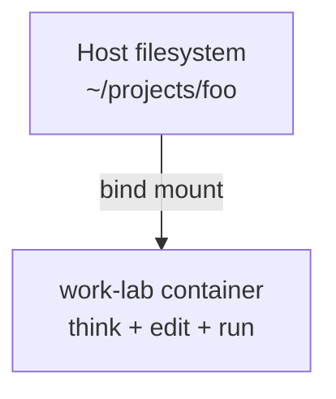
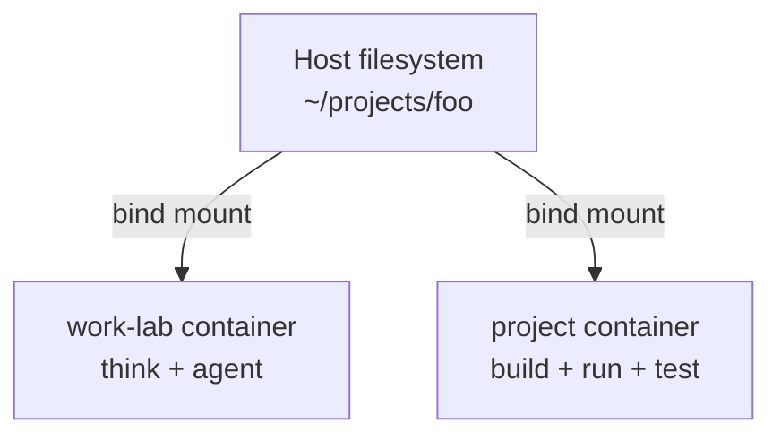

<!-- doc-audience: human, ai-editable -->
# work-lab

A container-based lab for humans and AI coding agents to think, plan, code, and operate in an experimental space protected by guardrails.

## TL;DR

| Your situation | Mode | What to do |
|----------------|------|------------|
| Project has no devcontainer | **Standalone** | `work-lab` is your devcontainer |
| Project has existing [devcontainer](https://www.daytona.io/dotfiles/ultimate-guide-to-dev-containers?utm_source=chatgpt.com) | **Sidecar** | Run both containers side-by-side |

> **Mental model:**
> work-lab is where you think and operate.
> Project devcontainers are where things run.
> They do not need to be the same place.

## What this is

`work-lab` is an **optional, personal** environment for:

- Thinking and planning
- Running coding agent tooling ([Claude](https://github.com/anthropics/claude-code), [Gastown](https://github.com/steveyegge/gastown), [SageOx](https://github.com/sageox/))
- Operating with `tmux`
- Experimenting safely

It provides a consistent shell with your tools, independent of whatever project you're working on.

## What this is NOT

- **Not a project template.** This repo never modifies the projects you work on.
- **Not a replacement for project devcontainers.** If a project has its own devcontainer, that's where builds and services run.
- **Not infrastructure.** No databases, no services, no orchestration.

---

## Quick start

```bash
# 1. Clone and open
git clone <this-repo>
cd work-lab

# 2. Start the container
devcontainer up --workspace-folder .
# Or open in any devcontainer-compatible IDE and "Reopen in Container"

# 3. Start working
tmux new -s lab
cd /workspaces/projects/your-project
claude    # or opencode, aider, etc.
```

### Using Helper script

A convenience script is provided at `bin/work-lab`:

```bash
work-lab up      # Start the devcontainer
work-lab shell   # Attach an interactive shell
work-lab tmux    # Attach to tmux session (creates 'lab' if missing)
work-lab stop    # Stop the container
work-lab doctor  # Check environment and configuration
```

To use: `export PATH="$PATH:/path/to/work-lab/bin"`

---

## Usage modes

### Standalone mode

`work-lab` **is** the devcontainer. One container does everything.



**When to use:** Project has no devcontainer, or you don't need its build environment.

**Why it works well:**
- No repo changes required
- Safe agent execution
- Reproducible tools
- One mental model

### Sidecar mode (Work with existing Devcontainer)

Two containers, both mounting the same project from your host filesystem.



**When to use:** Project has its own devcontainer with specific build tools, services, or runtime.

| Container | Purpose |
|-----------|---------|
| work-lab | Thinking, agents, operations |
| Project's devcontainer | Build, run, test, services |

**Key insight:** You do NOT merge devcontainers. They run independently, sharing only the filesystem via the host.

**Common patterns:**

1. **Control room**: Run Claude in work-lab, execute builds in project container
2. **Editor + agent**: Edit in work-lab, let project container handle compilation/tests
3. **Agent shell**: Project runs locally on host, work-lab is just for agents

> **Avoid:** Nesting containers, sharing Docker networks, syncing services. These lead to fragility.

---

## Installed tools

| Tool | Purpose |
|------|---------|
| tmux | Persistent terminal sessions |
| git, curl, jq, ripgrep, fzf | Standard utilities |
| Node.js 22 LTS | JavaScript runtime |
| Claude CLI | Coding agent |
| [Beads](https://github.com/steveyegge/beads) | Coding task management ideal for AI coding agents |
| [Gastown](https://github.com/steveyegge/gastown) | AI coding cagent orchestrator (optional) |

---

## Configuration

### Mounting projects

By default, `~/projects` on your host mounts to `/workspaces/projects` in the container.

To change this, edit `.devcontainer/devcontainer.json`:

```json
"mounts": [
  "source=/your/path/here,target=/workspaces/projects,type=bind,consistency=cached"
]
```

### User customization

Customize work-lab via `~/.config/work-lab/` on your host (XDG convention):

| File | When it runs |
|------|--------------|
| `post-create.sh` | Once, after container creation |
| `post-start.sh` | Every time container starts |

**Example:** Install a custom coding agent:

```bash
mkdir -p ~/.config/work-lab
cat > ~/.config/work-lab/post-create.sh << 'EOF'
#!/usr/bin/env bash
npm install -g opencode
cargo install --locked zellij  # install zellij tmux alternative [optional]
EOF
```

See `examples/` for more examples.

---

## Design principles

1. **Boring is good.** No clever abstractions. No magic.
2. **Optional always.** Nothing here is required.
3. **No repo modifications.** Projects remain untouched.
4. **Light tooling.** Only add what reduces thinking during initial setup.
5. **Clear boundaries.** `work-lab` provides thinking space, project devcontainers run.
